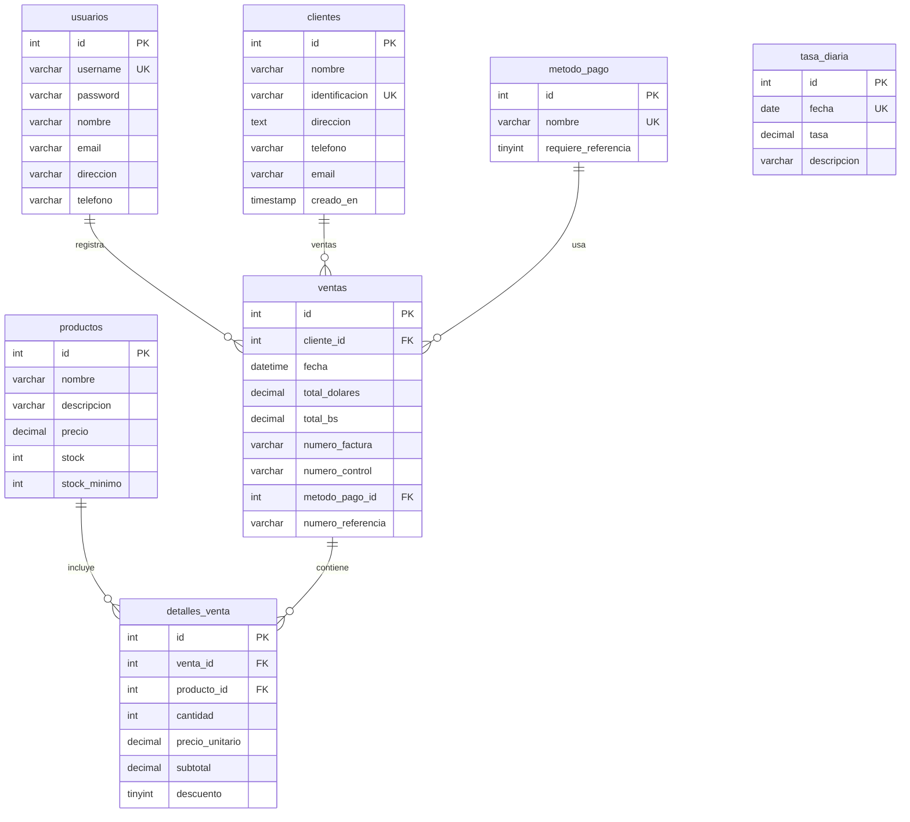
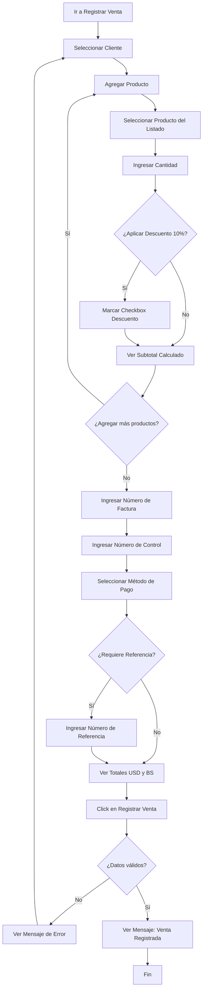
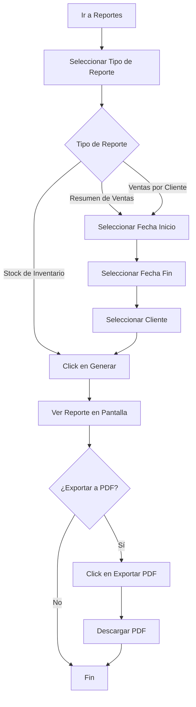
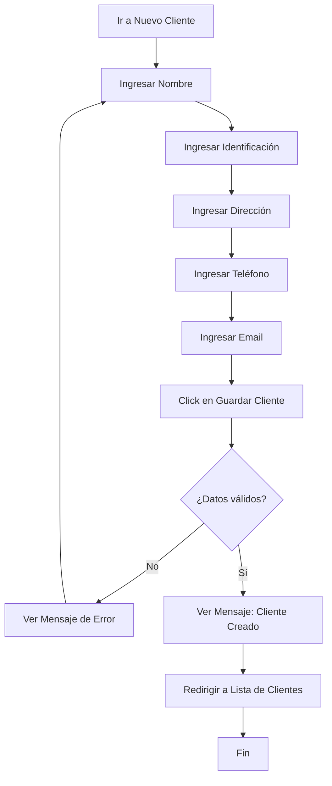
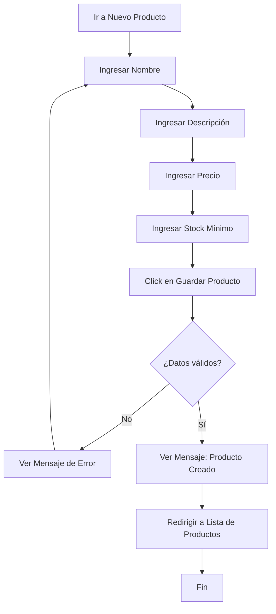
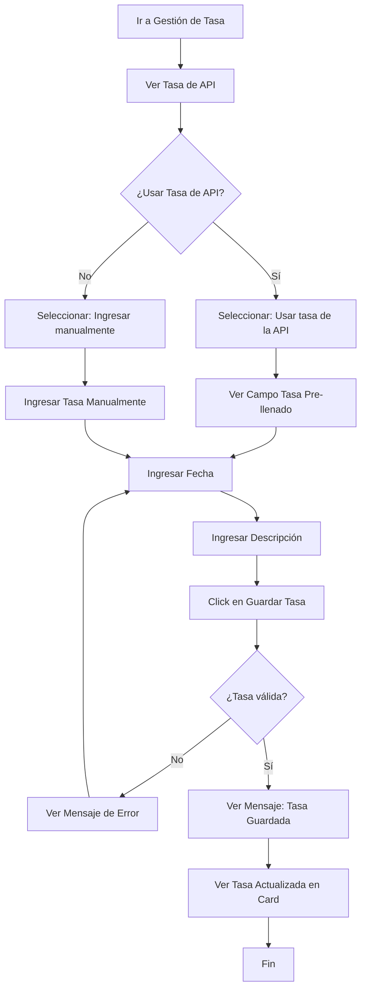

# Sistema de Gestión de Ventas - Defensa de Tesis

Sistema web para la gestión de ventas de zapatos desarrollado en PHP.

## 🚀 Inicio Rápido con Docker

### Prerrequisitos

- [Docker](https://www.docker.com/get-started) instalado
- [Docker Compose](https://docs.docker.com/compose/install/) instalado

### Instalación y Ejecución Paso a Paso

#### Paso 1: Clonar el Repositorio

```bash
git clone <url-del-repositorio>
cd Sistema-defensa-de-tesis
```

#### Paso 2: Verificar Archivos Necesarios

Asegúrate de tener estos archivos en el proyecto:

- `Dockerfile`
- `docker-compose.yml`
- `database/init.sql`
- `database/11-schema-final-ventas.sql`

#### Paso 3: Levantar los Contenedores

```bash
docker-compose up -d
```

Este comando:

- Construye la imagen de PHP/Apache
- Descarga la imagen de MySQL 8.0
- Descarga la imagen de phpMyAdmin
- Crea y levanta los contenedores en segundo plano
- Inicializa automáticamente la base de datos con los scripts SQL

#### Paso 4: Verificar que los Contenedores Estén Corriendo

```bash
docker-compose ps
```

Deberías ver 3 contenedores corriendo:

- `sistema_admin_web` (PHP/Apache)
- `sistema_admin_db` (MySQL)
- `sistema_admin_phpmyadmin` (phpMyAdmin)

#### Paso 5: Ver los Logs (Opcional)

Si quieres ver los logs para verificar que todo esté bien:

```bash
# Ver logs de todos los servicios
docker-compose logs -f

# Ver logs solo del servicio web
docker-compose logs -f web

# Ver logs solo de la base de datos
docker-compose logs -f db
```

#### Paso 6: Acceder a la Aplicación

Una vez que los contenedores estén corriendo:

- **Aplicación web**: http://localhost:8082
- **phpMyAdmin**: http://localhost:8081
  - Usuario: `root`
  - Contraseña: `rootpassword`

#### Paso 7: Verificar la Base de Datos

La base de datos se inicializa automáticamente. Los scripts se ejecutan en este orden:

1. `database/init.sql` - Crea la base de datos `sistema_admin`
2. `database/11-schema-final-ventas.sql` - Crea todas las tablas y datos iniciales

Puedes verificar en phpMyAdmin que las tablas se hayan creado correctamente.

#### Paso 8: Iniciar Sesión

- **Usuario**: `admin`
- **Contraseña**: `admin123`

### Comandos Útiles

```bash
# Detener los contenedores
docker-compose down

# Detener y eliminar volúmenes (elimina la base de datos)
docker-compose down -v

# Reiniciar los contenedores
docker-compose restart

# Reconstruir las imágenes
docker-compose build

# Ver el estado de los contenedores
docker-compose ps

# Acceder al contenedor de la base de datos
docker-compose exec db mysql -u root -prootpassword sistema_admin

# Acceder al contenedor web
docker-compose exec web bash
```

### Solución de Problemas

**Error: Puerto 8082 ya en uso**

```bash
# Cambiar el puerto en docker-compose.yml
# Busca "8082:80" y cámbialo por otro puerto, por ejemplo "8083:80"
```

**Error: La base de datos no se inicializa**

```bash
# Eliminar volúmenes y volver a crear
docker-compose down -v
docker-compose up -d
```

**Error: No se puede conectar a la base de datos**

```bash
# Verificar que el contenedor de la BD esté corriendo
docker-compose ps

# Ver logs de la base de datos
docker-compose logs db
```

### Credenciales por defecto

**Credenciales de la aplicación:**

- Usuario: `admin`
- Contraseña: `admin123`

**Base de datos:**

- Nombre: `sistema_admin`
- Usuario: `root`
- Contraseña: `rootpassword`

## 📁 Estructura del Proyecto

```
.
├── assets/          # Recursos estáticos (CSS, JS, imágenes)
├── includes/        # Archivos PHP compartidos (auth, conexion, header, footer)
├── src/            # Módulos de la aplicación
│   ├── clientes/
│   ├── ventas/     # Gestión de ventas (antes admin/)
│   ├── productos/
│   ├── reportes/
│   └── tasa/
├── database/       # Scripts SQL de la base de datos
├── Dockerfile      # Configuración de la imagen PHP
└── docker-compose.yml  # Configuración de servicios Docker
```

## 🗄️ Estructura de la Base de Datos

### Tablas Principales

El sistema utiliza una estructura simplificada enfocada en **ventas**:

1. **`usuarios`** - Autenticación y gestión de usuarios ✅
2. **`clientes`** - Información de clientes ✅
3. **`productos`** - Catálogo de productos
4. **`ventas`** - Registro de ventas
5. **`detalles_venta`** - Detalles de productos en cada venta
6. **`metodo_pago`** - Métodos de pago disponibles
7. **`tasa_diaria`** - Tasa de cambio USD/VES

### Diagrama de Relaciones (Mermaid)



## 📊 Diagramas de Flujo de Procesos

### 1. Proceso de Registro de Ventas



### 2. Proceso de Generación de Reportes



### 3. Proceso de Creación de Clientes



### 4. Proceso de Creación de Productos



### 5. Proceso de Gestión de Tasa Diaria



### Descripción de Tablas

#### `usuarios`

- Almacena información de usuarios del sistema
- Usado para autenticación y registro de quién realiza las ventas

#### `clientes`

- Información de clientes que realizan ventas
- Contacto unificado (teléfono y email en la misma tabla)

#### `productos`

- Catálogo de productos disponibles
- Precio unificado (no hay precio de compra/venta separados)
- `stock`: Cantidad actual disponible
- `stock_minimo`: Nivel mínimo de stock para alertas
- Stock que se descuenta automáticamente al vender mediante trigger

#### `ventas`

- Registro principal de cada venta
- Incluye información fiscal (número de factura y control)
- Almacena totales en USD y BS
- Relación con método de pago

#### `detalles_venta`

- Productos incluidos en cada venta
- Permite múltiples productos por venta
- Registra si se aplicó descuento del 10%
- **Trigger automático:** Descuenta stock al insertar

#### `metodo_pago`

- Catálogo de métodos de pago disponibles
- Indica si requiere número de referencia

#### `tasa_diaria`

- Tasa de cambio USD/VES por día
- Usada para calcular totales en BS

## 🛠️ Desarrollo Local (sin Docker)

### Prerrequisitos

- PHP 8.2 o superior
- MySQL 8.0 o MariaDB 10.4+
- Apache con mod_rewrite habilitado

### Instalación

1. **Configurar la base de datos**

   - Crear una base de datos llamada `sistema_admin`
   - Importar el script SQL desde `database/11-schema-final-ventas.sql`

2. **Configurar la conexión**

   - Editar `src/includes/conexion.php` con tus credenciales de base de datos

## 🚀 Despliegue en Render

### ⚠️ Nota Importante

Render **no soporta MySQL nativamente** en su plan gratuito. Tienes dos opciones:

1. **Usar MySQL Externo** (PlanetScale, Aiven, Railway)
2. **Usar Railway** (recomendado - soporta MySQL y docker-compose)

### Opción A: Desplegar en Render con MySQL Externo

#### Paso 1: Crear Base de Datos MySQL Externa

Elige uno de estos servicios gratuitos:

**PlanetScale** (Recomendado):

1. Ve a https://planetscale.com
2. Crea una cuenta gratuita
3. Crea una nueva base de datos
4. Anota las credenciales de conexión

**Aiven**:

1. Ve a https://aiven.io
2. Crea una cuenta gratuita
3. Crea un servicio MySQL
4. Anota las credenciales de conexión

#### Paso 2: Preparar el Repositorio

Asegúrate de que tu código esté en un repositorio Git (GitHub, GitLab, Bitbucket).

#### Paso 3: Crear Servicio Web en Render

1. Ve a https://render.com y crea una cuenta
2. Click en **"New +"** → **"Web Service"**
3. Conecta tu repositorio Git
4. Configura el servicio:
   - **Name**: `sistema-admin-web`
   - **Environment**: `Docker`
   - **Dockerfile Path**: `./Dockerfile`
   - **Docker Context**: `.`
   - **Plan**: Free (o el que prefieras)
   - **Region**: Elige la más cercana

#### Paso 4: Configurar Variables de Entorno

En la sección **"Environment"** del servicio web, agrega estas variables:

```
DB_HOST=<host-de-tu-mysql-externo>
DB_NAME=sistema_admin
DB_USER=<usuario-de-tu-mysql>
DB_PASS=<contraseña-de-tu-mysql>
PHP_ENV=production
```

**Ejemplo con PlanetScale**:

```
DB_HOST=aws.connect.psdb.cloud
DB_NAME=sistema_admin
DB_USER=tu_usuario
DB_PASS=tu_contraseña
PHP_ENV=production
```

#### Paso 5: Desplegar

1. Click en **"Create Web Service"**
2. Render comenzará a construir y desplegar tu aplicación
3. Espera a que el despliegue termine (puede tomar 5-10 minutos)

#### Paso 6: Inicializar la Base de Datos

Después del despliegue, necesitas ejecutar los scripts SQL:

**Opción 1: Desde tu máquina local**

```bash
# Conectarte a tu base de datos MySQL externa
mysql -h <host> -u <usuario> -p <database> < database/init.sql
mysql -h <host> -u <usuario> -p <database> < database/11-schema-final-ventas.sql
```

**Opción 2: Desde Render Shell**

1. Ve a tu servicio web en Render
2. Click en **"Shell"** (en el menú lateral)
3. Ejecuta:

```bash
mysql -h $DB_HOST -u $DB_USER -p$DB_PASS $DB_NAME < database/init.sql
mysql -h $DB_HOST -u $DB_USER -p$DB_PASS $DB_NAME < database/11-schema-final-ventas.sql
```

**Opción 3: Usar un cliente MySQL**

- Usa MySQL Workbench, DBeaver o phpMyAdmin
- Conéctate a tu base de datos externa
- Ejecuta primero `database/init.sql` y luego `database/11-schema-final-ventas.sql`

#### Paso 7: Verificar el Despliegue

1. Ve a la URL de tu aplicación (Render te la proporciona)
2. Deberías ver la página de login
3. Inicia sesión con:
   - Usuario: `admin`
   - Contraseña: `admin123`

### Opción B: Desplegar en Railway (Recomendado)

Railway soporta MySQL nativamente y es más fácil de configurar:

#### Paso 1: Crear Cuenta en Railway

1. Ve a https://railway.app
2. Crea una cuenta (puedes usar GitHub)

#### Paso 2: Crear Nuevo Proyecto

1. Click en **"New Project"**
2. Selecciona **"Deploy from GitHub repo"**
3. Conecta tu repositorio
4. Selecciona el repositorio `Sistema-defensa-de-tesis`

#### Paso 3: Configurar Servicios

**⚠️ IMPORTANTE**: Railway debe usar Docker, no Nixpacks. Si ves el error "Railpack could not determine...", sigue estos pasos:

1. **Forzar el uso de Docker**:

   - Ve a la configuración del servicio en Railway
   - En **"Settings"** → **"Build & Deploy"**
   - Cambia el **"Builder"** a **"Dockerfile"**
   - Asegúrate de que el **"Dockerfile Path"** sea `./Dockerfile`

2. **Si Railway detecta automáticamente el proyecto**:

   - Railway puede intentar usar Nixpacks primero
   - Debes cambiar manualmente a Dockerfile en la configuración

3. **Crear servicios**:

   - **Servicio Web**: Se crea automáticamente cuando conectas el repo
   - **Servicio MySQL**: Click en **"New"** → **"Database"** → **"MySQL"**

4. **Variables de entorno**:
   - Railway configurará automáticamente las variables de MySQL
   - En el servicio web, agrega estas variables para que coincidan con tu código:
     ```
     DB_HOST=${{MySQL.MYSQLHOST}}
     DB_NAME=${{MySQL.MYSQLDATABASE}}
     DB_USER=${{MySQL.MYSQLUSER}}
     DB_PASS=${{MySQL.MYSQLPASSWORD}}
     PHP_ENV=production
     ```

**Nota**: Si ves el error sobre `comprar_zapatos`, asegúrate de que esa carpeta no esté en el repositorio. Si existe, elimínala y haz commit.

#### Paso 4: Configurar Variables de Entorno (si es necesario)

En cada servicio, puedes agregar variables de entorno personalizadas si lo necesitas.

#### Paso 5: Inicializar la Base de Datos

**IMPORTANTE**: Los scripts SQL NO se ejecutan automáticamente en Railway. Debes ejecutarlos manualmente:

**Opción 1: Desde Railway Shell**

1. Ve al servicio MySQL en Railway
2. Click en **"Connect"** → **"MySQL"**
3. Usa las credenciales para conectarte
4. Ejecuta los scripts SQL en orden:
   ```sql
   -- Ejecuta el contenido de database/init.sql
   -- Luego database/11-schema-final-ventas.sql
   ```

**Opción 2: Desde tu máquina local**

```bash
# Obtén las credenciales de Railway MySQL
# Luego ejecuta:
mysql -h <MYSQLHOST> -u <MYSQLUSER> -p<MYSQLPASSWORD> <MYSQLDATABASE> < database/init.sql
mysql -h <MYSQLHOST> -u <MYSQLUSER> -p<MYSQLPASSWORD> <MYSQLDATABASE> < database/11-schema-final-ventas.sql
```

**Opción 3: Usar un cliente MySQL**

- Usa MySQL Workbench, DBeaver o TablePlus
- Conéctate usando las credenciales de Railway
- Ejecuta primero `database/init.sql` y luego `database/11-schema-final-ventas.sql`

#### Paso 6: Desplegar

1. Railway comenzará a construir y desplegar automáticamente
2. Espera a que termine el despliegue (puede tomar 5-10 minutos)
3. Verifica los logs para asegurarte de que no hay errores

#### Paso 7: Verificar

1. Railway te proporcionará una URL para tu aplicación (algo como `https://tu-app.railway.app`)
2. Accede a la URL
3. Deberías ver la página de login
4. Inicia sesión con:
   - Usuario: `admin`
   - Contraseña: `admin123`

### Solución de Problemas en Railway

**Error: "Railpack could not determine how to build the app"**

- Ve a Settings → Build & Deploy
- Cambia el Builder a "Dockerfile"
- Asegúrate de que el Dockerfile Path sea `./Dockerfile`

**Error: "Script start.sh not found"**

- Railway está intentando usar Nixpacks
- Fuerza el uso de Dockerfile en la configuración
- Los archivos `railway.json` y `railway.toml` deberían ayudar

**Error: Detecta carpeta no deseada**

- Elimina cualquier carpeta no necesaria del repositorio
- Haz commit y push de los cambios
- Vuelve a desplegar

**Error: No se puede conectar a la base de datos**

- Verifica que las variables de entorno estén correctas
- Asegúrate de usar las variables de Railway: `${{MySQL.MYSQLHOST}}`, etc.
- Revisa los logs del servicio web

**Error: Healthcheck failed / Service unavailable**

- El healthcheck ahora usa `/healthcheck.php` que no requiere base de datos
- Verifica que el archivo `healthcheck.php` esté en la raíz del proyecto
- Aumenta el `healthcheckTimeout` en `railway.toml` si es necesario
- Revisa los logs para ver si Apache está iniciando correctamente
- Asegúrate de que las variables de entorno de la BD estén configuradas antes del despliegue

Para más detalles, consulta [RAILWAY-SETUP.md](RAILWAY-SETUP.md)

### Archivos Importantes para Despliegue

- ✅ `Dockerfile` - Configuración de Docker para la aplicación
- ✅ `docker-compose.yml` - Configuración para desarrollo local
- ✅ `docker-compose.prod.yml` - Configuración optimizada para producción
- ✅ `render.yaml` - Configuración para Render (si usas Render)
- ✅ `railway.json` - Configuración para Railway (fuerza uso de Dockerfile)
- ✅ `railway.toml` - Configuración alternativa para Railway
- ✅ `nixpacks.toml` - Configuración para forzar Docker en Nixpacks
- ✅ `database/init.sql` - Crea la base de datos `sistema_admin`
- ✅ `database/11-schema-final-ventas.sql` - Crea todas las tablas y datos iniciales

### Solución de Problemas en Producción

**Error: No se puede conectar a la base de datos**

- Verifica que las variables de entorno estén correctas
- Asegúrate de que la base de datos esté accesible desde internet
- Verifica los logs del servicio web en Render/Railway

**Error: La base de datos no se inicializa**

- Ejecuta los scripts SQL manualmente
- Verifica que los archivos SQL estén en el repositorio
- Revisa los logs de la base de datos

**Error: La aplicación no carga**

- Revisa los logs del servicio web
- Verifica que el Dockerfile esté correcto
- Asegúrate de que el puerto 80 esté expuesto

### Recursos Adicionales

- [Documentación de Render](https://render.com/docs)
- [Documentación de Railway](https://docs.railway.app)

## 🐳 Comandos Docker Útiles

```bash
# Levantar los contenedores
docker-compose up -d

# Ver logs
docker-compose logs -f

# Detener los contenedores
docker-compose down

# Reconstruir las imágenes
docker-compose build --no-cache

# Acceder al contenedor PHP
docker exec -it sistema_admin_web bash

# Acceder a MySQL
docker exec -it sistema_admin_db mysql -u root -prootpassword sistema_admin
```

## 📝 Notas

- El puerto **8082** está configurado para la aplicación web (cambió de 8080 porque estaba en uso)
- El puerto **3306** está expuesto para conexiones MySQL externas
- El puerto **8081** está configurado para phpMyAdmin
- Los datos de la base de datos se persisten en un volumen Docker
- Los archivos SQL en `database/` se ejecutan automáticamente al iniciar el contenedor de MySQL
- Al acceder a http://localhost:8082, se mostrará automáticamente la pantalla de login

## 🔧 Configuración

Las variables de entorno se pueden configurar en `docker-compose.yml`:

- `DB_HOST`: Host de la base de datos (por defecto: `db`)
- `DB_NAME`: Nombre de la base de datos
- `DB_USER`: Usuario de la base de datos
- `DB_PASS`: Contraseña de la base de datos

## 📄 Licencia

Este proyecto es parte de una defensa de tesis.
